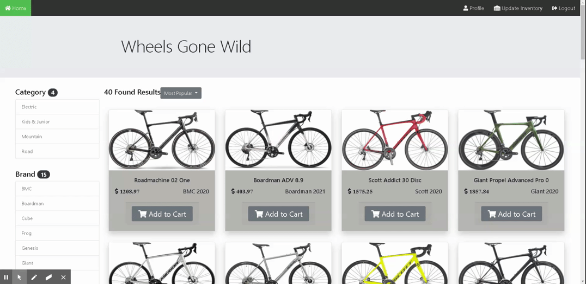

# WheelsGoneWild
[](https://opensource.org/licenses/MIT)

## Description
An e-commerce website built using handlebars and a MySQL database of 40 bikes. The website comes with an user and admin interface authenticated through passport. Bikes can be filtered 7 different ways and can be added to a shopping cart to a checkout. You can find the site [here](https://wheelsgonewild.herokuapp.com/)

### User Stories

AS A user,

I WANT to be able to find a bike that fits my needs easily

SO THAT I can maintain an active lifestyle

I WANT to be able to save my information when I login,

So THAT I can track my order history and make repeat shopping easier

### Business Context

For bike lovers who need to find a bike perfectly suited for them in the easiest way possible. 

### Acceptance Criteria

GIVEN the home page, I should be able to see and filter through a number of bikes from the database, so that I can easily narrow down a bicycle that appeals to me
GIVEN the home page, I should be able to login, so that I can see my order history be able to add things to the cart.
GIVEN the login page, I should be able to enter my information, so that I can create an account for future purchases.
GIVEN the cart modal, I should be able to edit the products and quantities, so that I can ensure my order is correct.

## Table of Contents
* [Installation](#Installation)
* [Usage](#Usage)
  * [Signup](#Signup)
  * [Profile](#Profile)
  * [Filters](#Filters)
  * [Cart](#Cart)
  * [Admin](#Admin)
* [Technologies](#Technologies)
* [Authors](#Authors)
* [License](#License)
* [Contributing](#Contributing)
* [Questions](#Questions)

## Installation
Download or clone the repo to a working directory and extract its contents. Use a **C**ommand **L**ine **I**nterface to install necessary dependencies by running the following command:
```
npm i
```
## Usage 
Type the following in any CLI to run the app. 
```
node server.js
```
Website features have also been demo-ed below
### Signup


### Profile


### Filters


### Cart


### Admin



## Technologies
* [Express](https://expressjs.com/)
* [Express handlebars](https://github.com/express-handlebars/express-handlebars)
* [MySQL](https://www.mysql.com/)
* [Sequelize](https://sequelize.org/)
* [Node](https://nodejs.org/en/)
* [Passport](http://www.passportjs.org/)
* [bcryptjs](https://github.com/dcodeIO/bcrypt.js#readme)
* [jQuery](https://jquery.com/)
* [ESlint](https://eslint.org/)
* [Bootstrap](https://getbootstrap.com/)
* [Fontawesome](https://fontawesome.com/)

## Authors
[Kambiz Frounchi](https://github.com/kambiz-frounchi), [Shamik Haldar](https://github.com/shamik05), [Adam Tartar](https://github.com/adamwrites)
## License 
This project is licensed under the MIT License - see the [LICENSE.md](LICENSE.md) file for details
## Contributing
Message any of the authors or open a pull request. See [CONTRIBUTING.md](CONTRIBUTING.md)
## Questions
Contact any of the [authors](#Authors)
